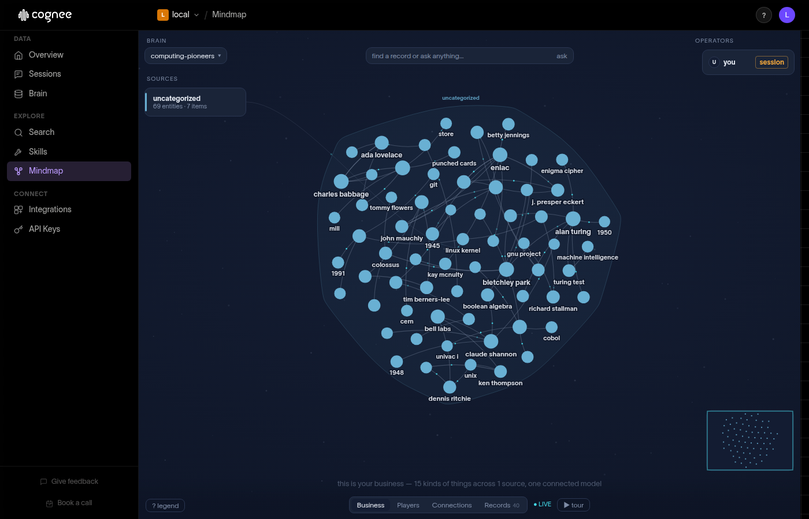

# Cognee for Cloudron

A [Cloudron](https://www.cloudron.io) package for [Cognee](https://github.com/topoteretes/cognee), an
open-source memory layer for AI agents: documents go in, a knowledge graph and a vector index come out,
and agents query them. This repository packages upstream release **v1.6.2** (commit `ba3631f`) on
`cloudron/base` 6.0.0. It contains no upstream source; the image build fetches it at the pinned commit.



## Install

From the community store at https://ca.cloudron.io, or directly (Cloudron 10 or newer):

```bash
cloudron install --versions-url https://raw.githubusercontent.com/OrcVole/cognee-cloudron/main/CloudronVersions.json --location cognee.example.com
```

After installing, follow the post-install checklist: set a real administrator address with `set-admin-email.sh`, and
read the memory and model-download notes. The sign-in is by email and password; the generated administrator
password is in `/app/data/.secrets/env` (see the post-install note).

## What the package does

- Runs Cognee's API and web interface behind one address. nginx sends `/health` and `/api/v<N>/` to the
  API and everything else to the interface.
- Uses the platform's PostgreSQL addon for the relational store. The graph store (Kuzu) and the vector
  store (LanceDB) are files under `/app/data`.
- Generates the three signing secrets and the administrator password once, into `/app/data/.secrets/env`,
  and never regenerates them (a restart would otherwise sign everyone out).
- Closes self-registration, turns telemetry off, and keeps upstream's model downloads out of the image:
  the local extraction and embedding models download on first use into `/app/models`, a persistent directory that is kept across updates and left out of backups.
- Installs the extraction runtime at build time, because installing it at runtime fails on a read-only
  filesystem.

Sign-in is by email and password only. There is no single sign-on and no mail.

## Files

| File | Purpose |
|---|---|
| `CloudronManifest.json` | the manifest (addons `localstorage` and `postgresql`; no sign-on addon) |
| `Dockerfile` | six stages: upstream's extension bundle, the source at the pinned commit, the interface build, the Python environment, then the base |
| `start.sh` | creates directories and secrets once, then starts supervisor |
| `supervisord.conf`, `nginx.conf` | the three processes and the front proxy |
| `run-backend.sh`, `run-ui.sh` | environment for each process, read fresh at every start |
| `set-admin-email.sh` | renames the administrator in the database and the stored address together |

## Test

```bash
podman build -t cognee-cloudron:dev .
test/smoke.sh cognee-cloudron:dev          # needs podman and internet access (models download on first use)
SMOKE_PG_IMAGE=docker.io/library/postgres:18 test/smoke.sh cognee-cloudron:dev
test/secret-scan.sh cognee-cloudron:dev    # the pre-publish release gate: repository and image
BASE=https://cognee.example.com EMAIL=... PASSWORD=... test/gate2.sh   # sign-in and the real job, against a live install
```

The smoke test runs the image the way the platform does (read-only root filesystem, a real PostgreSQL)
and checks health, closed registration, sign-in, adding documents, `cognify` with no language model,
search, the administrator rename, and a restart. `test/gate2.sh` runs the same kind of checks against a
live install over HTTPS and cleans up after itself.

## More

[`AGENTS.md`](AGENTS.md) is the working contract; [`docs/`](docs/) holds the decisions, the gate evidence
([`DEBUGGING.md`](docs/DEBUGGING.md)), the packaging log, and notes for the [Cloudron team](docs/FOR-CLOUDRON.md) and
the [Cognee project](docs/FOR-UPSTREAM.md).

## Licence

The package is released under the Apache License 2.0, the same as Cognee. See `LICENSE`.
